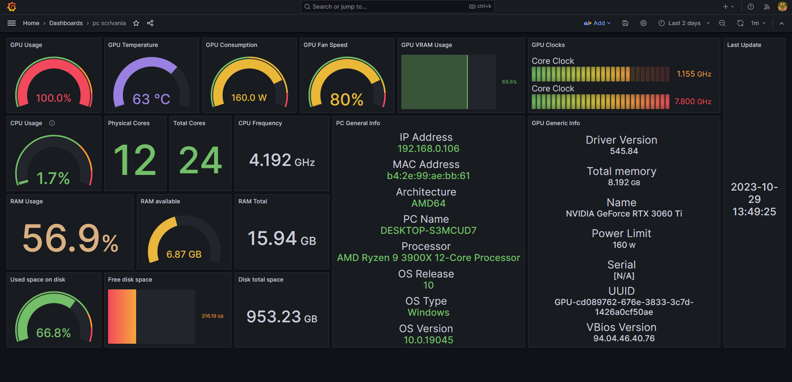

# MonitorStats
Collect data from PCs with Python, save into InfluxDB and visualize with Grafana using Raspberry Pi

## Requirements
- Raspberry Pi
  * [InfluxDB](https://www.influxdata.com/)
  * [Grafana](https://grafana.com/)
- [Python](https://www.python.org/) on the PC to retrieve the data

You can run the Python script on the Raspberry Pi or on other PCs.

### Python dependecies
- json
- time
- psutil
- platform
- py-cpuinfo
- socket
- uuid
- re
- [GPUtil](https://github.com/brottobhmg/gputil.git) (my fork)
- influxdb_client
- os

## My stuff
Tested with:
- Raspberry Pi 4B 8GB with OS 64bit
- Pc Windows10 with Nviadia gpu(s)
- Grafana version 10.2.0
- InfluxDB version 2.7.3
- Python >= 3.9.2

## How to
- Install [InfluxDB](https://randomnerdtutorials.com/install-influxdb-2-raspberry-pi/) on Raspberry
- Install [Grafana](https://grafana.com/tutorials/install-grafana-on-raspberry-pi/) on Raspberry
- Run 'pip install -r requirements.txt' on the PCs that run the Python script
- You need to fill some data into Python file (row 18-21):
  * 'pcName' : alias of the pc that are sending the information. If you run this code on several pc, this should be unique to avoid overlapping
  * 'org' : name of your organization in InfluxDB
  * 'url' : the url of your Raspberry in the LAN
  * 'bucket' : name of the destination bucket in InfluxDB to save all information 
- Retrieve a "All Access API Token" on InfluxDB and [set it](https://www.twilio.com/blog/how-to-set-environment-variables-html) as environment variable
- Run the Python script, it upload the data every minute.
- Now you can see on 'Data Explorer' menu in InfluxDB the retrieved data. To do this, select the bucket name created before, change first filter with key 'source' and select your 'pcName', submit the query.
- Bind InfluxDB to Grafana as 'Data Sources'. Set as "Query language" Flux, insert HTTP URL http://localhost:8086 (if you run InfluxDB on the same machine of Grafana, like me), enable "Basic auth" and enter the credential of Grafana, fill the "Organization" field with your organization name (the same name inserted in the Python script), insert into field "Token" the API Token created before, insert into "Default Bucket" the bucket name created before (the same name insert in the Python script).
- On the 'Dashboard' menù of Grafana now you can create your own dashboard. You can find a template on the .json file (i call my bucket "allPcStats" and my pcName is "pc scrivania", replace it with yours in the json or after import on Grafana to use same template).

